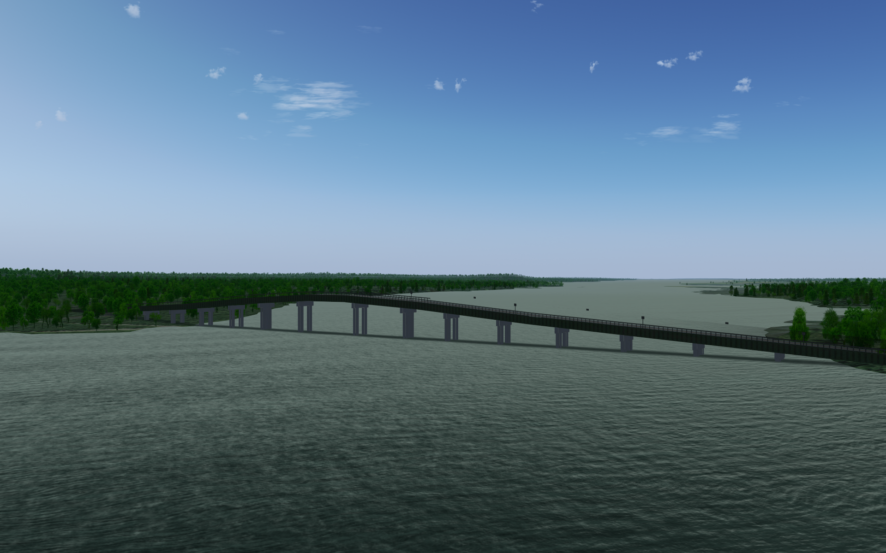

3D model of the Quinte Skyway
=============================

Low-polygon model of the Quinte Skyway, a bridge across the Bay of Quinte (off Lake Ontario) between Tyendinaga Mohawk territory and Prince Edward County.  The bridge is designed to be viewed at a distance (e.g. in a flight simulator), but is driveable.

Closest airport: [Tyendinaga Mohawk](https://ourairports.com/airports/CPU6/) (CPU6).

## UnLicense

This model is released into the Public Domain. See UNLICENSE.md for details.

## Author

Started by David Megginson, November 2024.  Attribution is appreciated, but not required.
